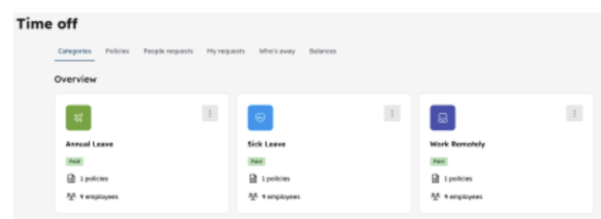

# Workday like Employee Portal

## Problem 1: Employee Database Management System

Develop a simple Employee Database Management System using Object-Oriented
Programming

```text
Class Employee
    Attributes (all should be immutable and strongly typed):
        employee_id: Final[UUID]
        name: Final[str]
        position: Final[str]
        email: Final[str]
        salary: Final[float]
        created_at: Final[datetime]
        modified_at: Final[datetime]
        
    Methods:
       - A constructor to initialize all attributes.      
       - __str__ method to return a string representation of the employee.
```

```text
Class EmployeeDatabase
    Attributes:
        A private attribute to store employee objects.
    
    Methods:
       - add_employee: Adds a new Employee to the database.
       - update_employee: Updates an existing Employee to the database.
       - get_employee: Retrieves an Employee's information by ID.
       - get_all: Returns all the employees.
       - __str__: Returns a string representation of all employees in the database.
```

### Complexities
1. Although the database functionality will work locally due to the
   scope of this exercise, it must simulate is a remote server with a different timezone,
   Therefore, create a utility class/function to supply the datetime as if there was a different timezone.
2. Whenever returning any employee, the created/modified fields should be
   returned but transformed in local datetime, considering the mocked server
   timezone.
3. The email format must be checked, and raise an exception if invalid.

### Notes:
1. Results should be dumped into the console.
2. For the database you can use an embedded one such as H2 or SQLite.

## Problem 2: Time-off module

In our Time Off module we have Time Off Categories that you can use to
request the right time for those categories as a team member.<br>

We added a rule that you can’t request two categories at the same time with
the same date range. However, there is a case that you can have Work Remotely
applicable, and you want to request Annual leave.

Right now the constraint of two categories can’t be overlapping is present
since you can’t request annual leave while we have another category within
the same dates.


<p style="text-align: center;">Figure 1: Timeoff Module Representation</p>

### Database Tables

```text
    - Time_off_request
        - Id
        - request_category_id
        - employee_id
        - start_date
        - end_date
    
    - Request_category
        - id
        - Name
```

## Problem 3: Public Holiday Service

**Goal**: Create a service that will provide the public holidays from the employees that you have from exercise 1 (create fake employees).

Requirements:
* Service should return the current 7 days public holidays for the employees' residence location
* Create an email alert with the current public holidays in the next 7 days upcoming
* Store from a 3rd party API or you parse it online to get the source of truth of the public holidays

### Notes:
- Tech stack/language up to you

## Clarifying Questions Asked

- The attachment mentions Python. However, is it okay if I implement everything in Java, since I have higher proficiency in that as of today? Additionally, as mentioned in the attachment, I ll try to use vanilla Object Oriented Principles along with best practices and design patterns for my implementation. Let me know if this sounds good to you.
    - _You can do any tech stack_
- Is a REST API needed as a part of the assignment or should we be okay to access the functionalities via Unit Tests, given we are using an in-memory database?
    - _up to you_
- The email prompt says - "Create a service that will provide the public holidays from the emp...." Does it mean that the service needs to be deployed in the public cloud as well or just sharing a zipped application should be fine in which the unit tests execute to validate all possible scenarios?
    - _up to you_
- For this prompt - "Service should return the current 7 days public holidays for the employees residence location". By the current 7, do you mean the next 7 public holidays? Also, do we return just the next 7 dates or the names of the public holidays as well like <25 December, Christmas>?
    - _in the next 7 days, names of the public holidays_
- In case multiple holidays occur on the same day, can we show any one of them, since it eventually just means a holiday for the employee or should we show all of the holidays to the user for their location on that day?
    - _yes_
- For prompt 2 for the email alerts: In case of the multiple holidays in next 7 days, thinking that we can keep the frequency of email alerts once a week (probably each Sunday). Let me know if that sounds good.
    - _yes makes sense_
- "Store from a 3rd party api or you parse it online to get the source of truth of the public holidays" - I am thinking of this as a one time activity that can be done each year along with periodic reviews once a month. Would this be okay?
    - _ok_
- Additionally, I am planning to keep both the services as a monolith which means all of the code would be in a single repository, but in separate Employee and Holiday specific modules. Planning to do this to ease out the tests execution. Let me know if this should be okay.
    - _ok_
- Since the assignment was shared today, I am aiming to complete it by Tuesday 3:00 PM SGT ie 2 days from now. Would that be okay, David?
    - _Noted_
